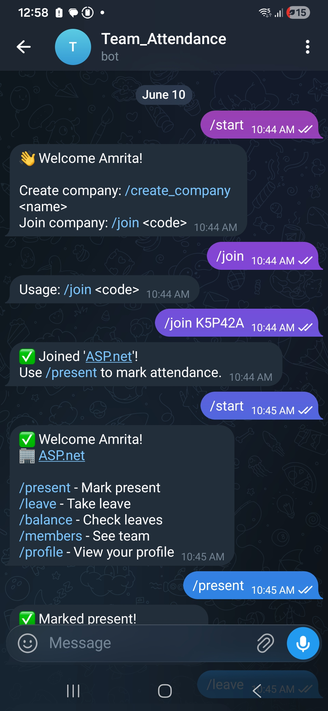
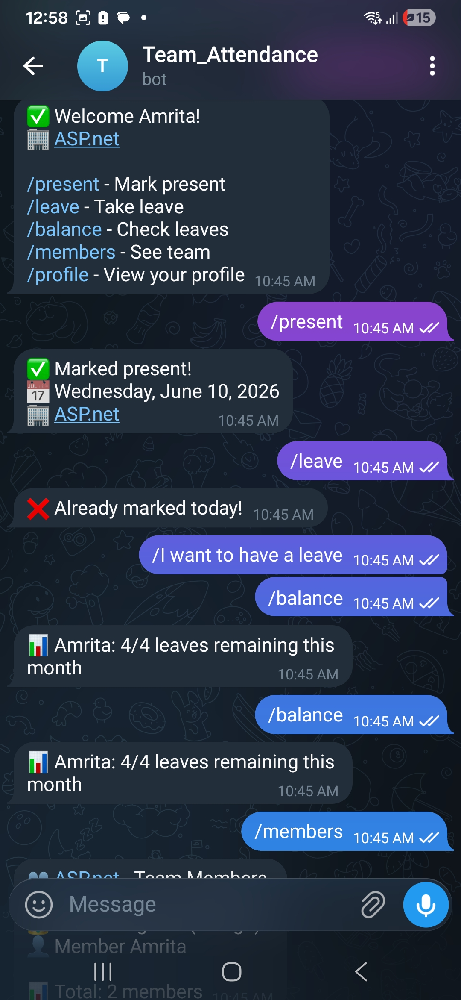
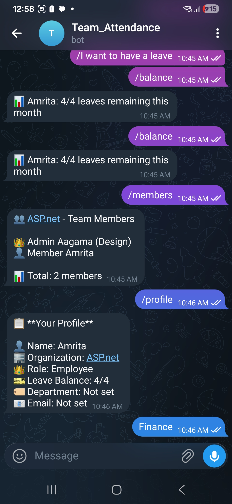
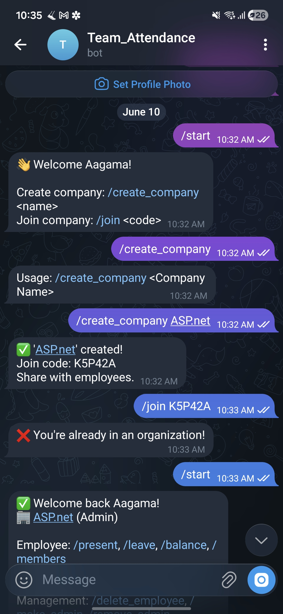
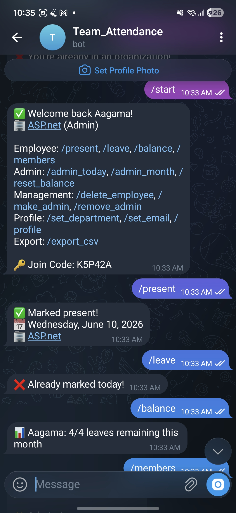
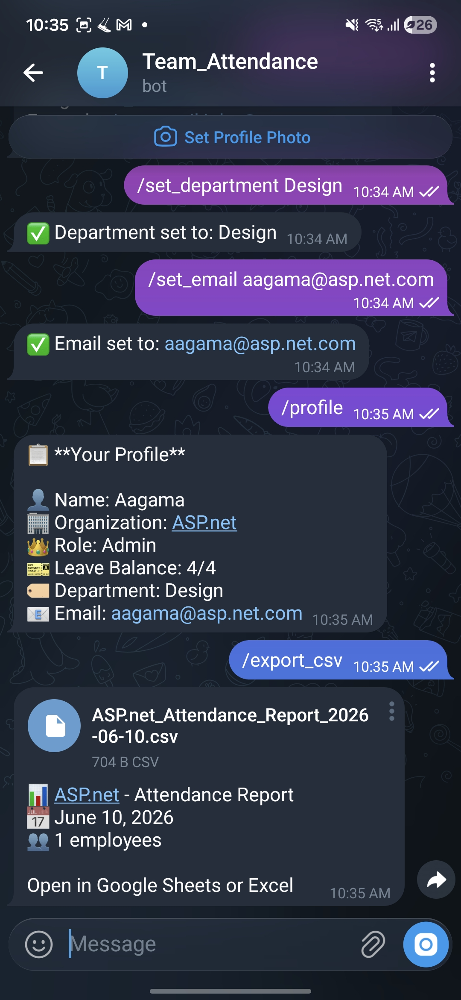

# 📊 Team Attendance Bot

> **A multi-tenant attendance and leave management system for small teams — built as a Telegram Bot.**

[](https://t.me/Att_end_ance_bot)
[](https://www.python.org/)
[](https://render.com)

**🤖 Live demo:** [t.me/Att_end_ance_bot](https://t.me/Att_end_ance_bot) — send `/start`, create a test company, and try it in under a minute.

---

## The Problem

Small teams (10–50 people) track attendance through daily WhatsApp polls. Employees get notification fatigue and have no privacy or visibility into their leave balance. Admins do 200+ manual checks a month, count responses by hand, and maintain a separate spreadsheet for leaves.

## The Solution

A Telegram bot, so there's **no new app to install**:

- ⚡ Mark attendance in 2 seconds with `/present`
- 📊 Automatic leave tracking — 4 leaves/month, auto-reset each month
- 👁️ Real-time team view and one-tap CSV reports for admins
- 🏖️ Weekends ignored automatically
- 🏢 Multi-tenant — any number of organizations, fully isolated, joined via secure 6-character codes

---

## 📱 Screenshots

### Employee experience

| Onboarding & joining | Marking attendance | Profile & balance |
|---|---|---|
|  |  |  |

### Admin experience

| Creating a company | Daily team view | CSV export |
|---|---|---|
|  |  |  |

---

## 🎯 Commands

| For everyone | For admins |
|---|---|
| `/start` — welcome & command list | `/admin_today` — full team attendance today |
| `/present` — mark present (Mon–Fri) | `/admin_month` — monthly summary |
| `/leave` — request leave (4/month) | `/export_csv` — downloadable CSV report |
| `/balance` — remaining leaves | `/reset_balance` — reset team leave balances |
| `/members` — see the team | `/make_admin` / `/remove_admin` |
| `/profile`, `/set_department`, `/set_email` | `/delete_employee` |
| `/create_company <name>` / `/join <code>` | |

---

## 🛠️ Tech Stack & Architecture

| Layer | Choice | Why |
|---|---|---|
| Language | Python 3.12 | |
| Bot framework | python-telegram-bot 21.x | async handlers, long polling |
| Database | SQLite | zero-config, perfect for small-team scale |
| Keep-alive | Flask health endpoint + cron-job.org | required for polling bots on free hosting |
| Hosting | Render | deploy from Github in minutes |

```
Team_Attendance_Bot_v2/
├── bot.py                 # Entry point: handlers, Flask health server
├── database.py            # Schema (auto-created on startup), all queries, IST time helpers
├── database_setup.py      # Optional manual setup (safe — never deletes data)
├── utils.py               # Rate limiting
├── requirements.txt       # Dependencies
├── .python-version        # Pins Python 3.12 on Render
├── commands/
│   ├── employee.py        # /present /leave /balance /members
│   ├── admin.py           # /admin_today /admin_month /reset_balance
│   ├── management.py      # roles, department, email, profile
│   └── export.py          # CSV report generation
└── Screenshots/           # Demo images used in this README
```

**Design decisions worth noting:**
- **Lazy monthly reset** — leave balances reset the first time an employee interacts in a new month (tracked via `last_reset_month`), so no scheduler is needed.
- **Timezone-correct** — all dates computed in IST (`Asia/Kolkata`), so attendance dates are right even on UTC servers.
- **Self-initializing schema** — tables are created automatically on first boot (`CREATE TABLE IF NOT EXISTS`); deploys need no manual setup step.
- **Data isolation** — every query is scoped by `org_id`; one organization can never see another's data.
- **Abuse protection** — per-user rate limiting (20 commands/minute) and admin-only guards on sensitive commands.

---

## 🚦 Run It Locally

```bash
git clone https://github.com/aagamaar/Team_Attendance_Bot_v2.git
cd Team_Attendance_Bot_v2
pip install -r requirements.txt

# Get a token from @BotFather on Telegram, then:
export TELEGRAM_TOKEN="your-token-here"     # Windows: set TELEGRAM_TOKEN=your-token-here
python bot.py
```

Open your bot on Telegram → `/start` → `/create_company MyCompany` → `/present`. Done.

## ☁️ Deploy on Render (free)

1. Fork/push this repo to GitHub
2. [render.com](https://render.com) → **New → Web Service** → connect the repo
3. Build command: `pip install -r requirements.txt` · Start command: `python bot.py`
4. Add environment variable `TELEGRAM_TOKEN`
5. Deploy — tables create themselves on first boot

**Keep-alive (required):** free Render services sleep after 15 minutes, and a sleeping polling bot can't hear messages. Create a free [cron-job.org](https://cron-job.org) job that pings your service URL every 10 minutes.

> ⚠️ **Free-tier note:** Render's free filesystem is ephemeral — the SQLite database resets when the service redeploys or restarts. Fine for demos and trials. For production, attach a persistent disk (Render Starter) or migrate to Postgres.

---

## 📈 Business Rules

- 4 leaves per employee per month; unused leaves don't carry over
- Balances reset automatically each calendar month
- Weekends are ignored — no marking needed, no leave deducted
- One attendance record per person per day (double-marking blocked at the database level)
- Multiple admins per organization supported

## 🗺️ Roadmap

- [ ] Undo command for mistaken `/present` or `/leave`
- [ ] Half-day leave support
- [ ] Postgres option for persistent hosting
- [ ] Daily reminder (opt-in) for employees who haven't marked

---

## 👩‍💻 Author

**Aagama A R** — [GitHub](https://github.com/aagamaar) · [LinkedIn](https://linkedin.com/in/YOUR_LINKEDIN)

Built with [python-telegram-bot](https://github.com/python-telegram-bot/python-telegram-bot). Hosted on [Render](https://render.com).

⭐ **Star this repo if you found it useful!**
